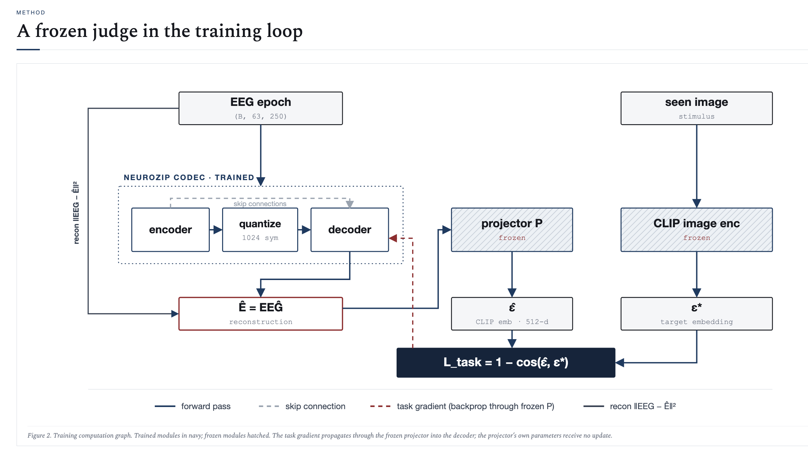

# NeuroZip architecture & design rationale

This is the "why" doc. The **what** (run instructions, file map, numbers
table) lives in [README.md](README.md). Inline docstrings in each module
explain how individual pieces work.

## The setup in one paragraph

NeuroZip is an EEG codec trained so that what survives compression is the
CLIP-decodable semantic content of the EEG, not its waveform fidelity. A
trainable encoder–quantizer–decoder shrinks an EEG epoch to a small integer
latent and back. Alongside the usual rate + reconstruction loss, a frozen
*judge* (an EEG→CLIP projector pre-trained against the dataset's CLIP image
features) measures how close the *reconstructed* EEG lands to the CLIP
embedding of the image the subject actually saw. The codec is penalized for
moving away from that point. At inference, free text is encoded by CLIP's
text encoder and used to retrieve EEG epochs whose decompressed projection
lands closest in CLIP space.

## The three things to get right

These are also reproduced in the code comments (the codec docstring lists
them as the "three easy-to-get-wrong spots"):

1. **Gradient flow through the frozen judge.**
   `P` and CLIP are frozen (`requires_grad_(False)` on `P`, `no_grad` on the
   target embedding). The decoder must still receive gradient *through* `P`
   (i.e. don't wrap `P(EEĜ)` in `no_grad`; only the *target*
   `CLIP_image(seen_image)` is detached). `train.py:_grad_flow_assert()`
   runs at Stage-3 startup and asserts (a) the decoder gets non-zero grad
   from a task-only backward, (b) the judge's parameters do not. Skipping
   this check is the most common silent failure mode.

2. **Quantizer mismatch.**
   Training adds `Uniform(-0.5, 0.5)` noise as a differentiable proxy for
   integer rounding. Inference uses `torch.round`. Forget the noise at
   training time and `round()` breaks the decoder at inference. See
   `codec.py:quantize()`.

3. **Normalization stats round-trip.**
   EEG is per-channel z-normalized in `data.py`. The mean/std are cached at
   `data/norm_stats.pt`. They're needed (a) to invert the codec output to
   real microvolts for fidelity reporting, and (b) so bpp is *bits per
   normalized sample*, comparable across configs and against the fp16
   storage baseline.

## The data flow



ASCII version of the same diagram, with shape annotations:

```
                    ┌─────────────── frozen ────────────────┐
EEG epoch ──► encoder ──► quantize ──► decoder ──► EEĜ ──► P ──► ε̂ ┐
(B, 63, 250)        (B, c_lat, 32)              (B, 63, 250) (B, 512)    │
                                                                          │
                                                          1 - cos(ε̂, ε*) ←┘
                                              ┌──────────────────────────────┐
                                              │ frozen: CLIP_image(seen_img) │
                                              │           = ε*               │
                                              │  (detached, no_grad)         │
                                              └──────────────────────────────┘

   L  =  λ_rate · bits(latent | prior)
      +  λ_recon · ‖EEG − EEĜ‖²
      +  λ_task · ( 1 − cos(P(EEĜ), CLIP_image(seen_image)) )
```

Latent shape default: `c_lat=32` channels × 32 timesteps = 1024 integer
symbols per epoch. Rate is estimated under a factorized Laplace prior with a
learnable per-channel scale.

## The judge (`clip_proj.py`)

The projector `P` is a small dedicated network: depthwise temporal conv →
spatial mixer → 4-stage conv tower → (with `n_attn > 0`) [CLS]-token
transformer head → L2-normalize → 512-dim CLIP-space vector.

Trained Stage 1 with symmetric InfoNCE against the dataset's precomputed
CLIP image features (LAION-2B variant; see "the CLIP gotcha" below).
Frozen for all later stages.

The `n_attn` parameter is the lever for the "attention on the projector"
result discussed below:

| `n_attn` | description | params | top-1 / top-5 / top-10 |
|---:|---|---:|---:|
| 0 | original conv-only (AvgPool + MLP head) | 2.5 M | 13.5% / 37.5% / 50.5% |
| 2 | [CLS] + 2 transformer blocks (4 heads) | 6.0 M | 18.5% / 45.0% / 65.0% |

The transformer head lets the projector directly compare ERP windows
(P100 vs N170 vs P300, etc) in a single attention op rather than relying on
the conv stack's stacked receptive field. ~+37% top-1 for one design change
that costs nothing inside the codec's loop.

## The codec (`codec.py`)

A 1D-conv autoencoder over time, with optional ViT bottleneck (`n_attn > 0`)
between the conv tower and the latent projection.

Architectural design choices:

* **Time as the sequence axis, channels as features.** EEG has 63 channels
  × 250 timesteps. The codec downsamples *time* (250 → 32) and lets the
  decoder mirror; channels are mixed only via 1×1 convs and (in the ViT
  variant) inside transformer MLPs.
* **Mirror padding for clean downsample.** 250 → mirror-pad to 256 → /2/2/2
  → 32 latent timesteps. Decoder undoes the symmetry then crops back.
* **Factorized Laplace prior.** Per-channel learnable scale. Bits per
  symbol = `-log2(CDF(y+0.5) - CDF(y-0.5))`. Trained jointly with the
  codec, so the prior reflects whatever distribution the codec actually
  produces.

## The v1 → v4 evolution (and what we learned)

| version | codec | projector | classifier | story |
|---|---|---|---|---|
| **v1** | conv-only (0.75 M) | conv-only (2.5 M) | conv-only | first runnable; NeuroZip dominates everywhere |
| **v2** | ViT, n_attn=2 (4.3 M) | conv-only (2.5 M) | conv-only | bigger codec, slight gains, longer training |
| **v3** | ViT, n_attn=2 (4.3 M) | **ViT, n_attn=2 (6.0 M)** | ViT, n_attn=2 | stronger judge; NeuroZip win **shrank** |
| **v4** | conv-only (0.75 M) | ViT, n_attn=2 (6.0 M) | ViT, n_attn=2 | clean baseline + strong judge; recommended |

### Why v3 hurt the story

Switching the codec to ViT was supposed to lift everything; instead it
collapsed the gap between fidelity and NeuroZip. Three reinforcing
mechanisms:

1. **Capacity leak into the baseline.** A ViT bottleneck captures long-
   range temporal structure even when the loss is pure MSE. Some of that
   structure is exactly the ERP timing the projector keys off. So the
   fidelity baseline was implicitly preserving semantic content without
   ever seeing the task loss.
2. **Judge saturation.** Stronger judge → higher floor for *everyone*.
   The held-out classifier went from 53–85% (fidelity, v1 conv judge) to
   99–100% (fidelity, v2 attention judge). Differentiation collapsed.
3. **Underconverged ViT codec.** The 4.3 M-param codec needed more than
   30 epochs to fully train; in our budget its MSE was actually *worse*
   than the 0.75 M conv codec. NeuroZip warm-started from undertrained
   fidelity codecs and inherited the deficit.

### Why v4 is the recommendation

The contribution of NeuroZip is **task-aware training**, not codec
expressiveness. The cleanest demonstration is: hold the codec architecture
fixed across fidelity and NeuroZip, vary only `lambda_task`. v4 does that:

* **Codec = conv-only**, so the fidelity baseline can't ride architectural
  capacity to fake semantic preservation. The "free" task signal the v2
  baseline was getting is gone.
* **Projector = attention**, so the task gradient is sharp and retrieval
  at inference is strong. The judge upgrade doesn't pollute the baseline
  because the baseline doesn't see the projector during training.
* **Classifier = attention**, so the circularity defense uses a strong
  independent judge that isn't trivially fooled.

The clean experimental claim under v4 is: "with the codec held fixed, the
task loss preserves more CLIP-decodable content per bit than MSE+rate
alone."

## The CLIP gotcha

The dataset (`Haitao999/things-eeg`) ships precomputed CLIP image and text
features at `Preprocessed_data_250Hz_whiten/ViT-B-32_features_*.pt`. The
file names say "ViT-B-32", but **the features are not from the standard
OpenAI weights**; they're from the LAION-2B variant
(`open_clip.create_model_and_transforms('ViT-B-32', pretrained='laion2b_s34b_b79k')`).

Verified by direct cosine: an image encoded by LAION-2B's encoder matches
the dataset's precomputed image feature at cos = 0.98; OpenAI's encoder
gives cos = -0.06 (orthogonal, different space entirely).

This matters because `P` is trained against the dataset's image features,
so its output lives in LAION-2B space. The live-inference text encoder in
`serve.py` *must* use the matching variant or free-text retrieval breaks
silently (CLIP query lands in a different subspace, retrieval becomes
random). Same constraint applies if you ever swap the dataset for a
differently-encoded one.

## The circularity defense

The codec is trained with `P` + CLIP in the loop. If we *only* evaluated
retrieval with `P` + CLIP, "great numbers against your own judge" is a
fair takedown. So:

* `train.py classifier` trains a **separate** EEG→concept classifier on
  60 reps × 200 concepts of the test split (averaging blocks of 10 reps
  per training sample for SNR). It never sees codec output.
* At evaluation, the classifier scores top-1 on the codec's decompressed
  EEG. Differentiation here means NeuroZip's win generalizes beyond the
  judge it was trained against.

With the v4 (attention) classifier this judge is so strong it tends to
saturate near 100% for both NeuroZip and fidelity. That's not a bug;
it's the held-out classifier saying "both methods preserve enough EEG
to identify the concept". The discrimination between methods shows up
in the harder projector-based retrieval metric instead.

## Inference / demo paths

Two viewing surfaces, both backed by the same checkpoints:

* `serve.py`: Flask backend, live CLIP encoding (LAION-2B), on-demand
  codec reconstruction, server-rendered matplotlib figures returned as
  base64 PNGs. `demo.html` is the SPA front-end. Reachable on
  `0.0.0.0:8011` via `./serve.sh`.
* `notebook.ipynb`: standalone Jupyter notebook. Auto-detects which codec
  generation is on disk (prefers v4), reuses checkpoints. 20 cells:
  setup → metrics table → rate–retrieval plot → reconstruction viewer
  → free-text retrieval → per-channel MSE + entropy histograms.

Both use the same `data.py` / `clip_proj.py` / `codec.py` modules, so the
notebook and the server cannot drift apart.

## Honest scope caveat

THINGS-EEG epochs are 1-second visual-presentation trials, not multi-hour
clinical recordings. The storage pressure NeuroZip addresses is
**dataset-scale**: millions of labeled trial epochs of brain↔image pairs.
The Haitao re-release already re-stored EEG in float16 to halve size;
that's evidence the storage pressure is real for exactly this kind of
data. Generalizing to long continuous recordings is future work and would
require treating the codec as a streaming model rather than per-epoch.

## Note on `plots/architecture.png`

The schematic image above is a hand-drawn diagram (committed as a static
PNG, no generator script). The ASCII data-flow block immediately below
it is the source of truth and is generated by editing this file. If you
update the model and the schematic drifts, redraw it or fall back to the
ASCII block; do not assume the PNG and the equation stay in lockstep
automatically.
