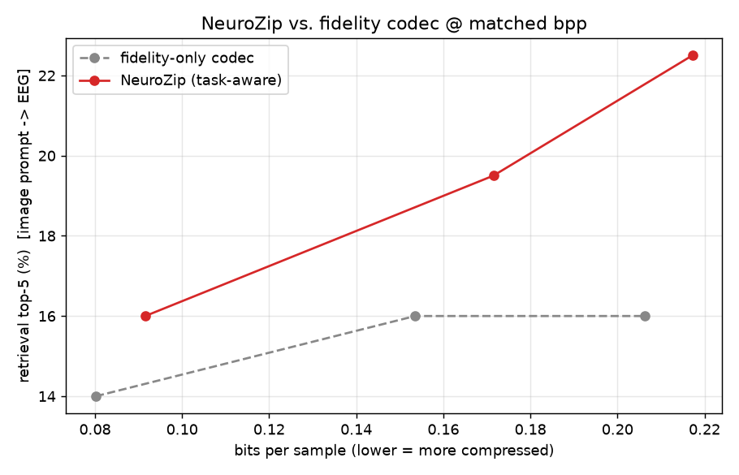

# NeuroZip

<div align="center">

[](https://www.python.org/)
[](https://pytorch.org/)
[](https://github.com/mlfoundations/open_clip)
[](https://huggingface.co/datasets/Haitao999/things-eeg)
[](https://polyformproject.org/licenses/noncommercial/1.0.0/)



</div>

Task-aware neural compression of single-trial EEG. The codec is trained to preserve the decodable semantic content of each epoch (the CLIP embedding of the viewed stimulus) rather than to minimize waveform reconstruction error. At 144x compression, free-text retrieval over the compressed corpus is preserved; a fidelity-only codec at a comparable rate is not.

## Contents
- [Abstract](#abstract)
- [Method](#method)
  - [Architecture](#architecture)
  - [Objective](#objective)
  - [Biological localization](#biological-localization)
- [Results](#results)
  - [Projector](#projector)
  - [Codecs](#codecs)
  - [Rate-distortion trade-off](#rate-distortion-trade-off)
  - [Storage](#storage)
- [Repository layout](#repository-layout)
- [Reproduction](#reproduction)
- [Limitations](#limitations)
- [Acknowledgements](#acknowledgements)
- [Authors](#authors)

## Abstract

EEG datasets that pair brain responses with stimuli are large and growing, and are commonly stored at reduced precision (float16). Standard lossy codecs minimize mean squared error (MSE), which does not preserve the signal components that carry stimulus identity. NeuroZip adds a task-aware term to the rate-distortion objective: the reconstructed epoch is projected into CLIP space by a frozen EEG-to-CLIP projector, and the codec is penalized by the cosine distance between that projection and the CLIP image embedding of the presented stimulus. Gradient propagates through the frozen projector into the decoder. The fidelity baseline and the task-aware codec share architecture and training budget and differ only in the weight of the task term (`lambda_task` = 0 versus 3.0); observed differences are therefore attributable to the objective rather than to model capacity. On THINGS-EEG (subject `sub-01`), the task-aware codec improves top-5 image-prompt retrieval by 4 to 11 percentage points over the fidelity baseline at matched bitrate, at a cost of at most 5 percent in reconstruction MSE.

## Method

### Architecture

The codec is a 1D convolutional autoencoder over time. An epoch of shape (63, 250) is encoded to a latent of (32 channels, 32 timesteps) = 1024 integer symbols, quantized, and decoded. Quantization uses additive uniform noise in [-0.5, 0.5] during training as a differentiable proxy for rounding, and integer rounding at inference. The bitrate is estimated by a factorized Laplace prior with a learnable per-channel scale.

The projector P maps an epoch to a 512-dimensional CLIP-space vector through a depthwise temporal convolution, a channel mixer, a four-stage convolutional tower, an optional [CLS] token with transformer blocks, and L2 normalization. It is trained once with symmetric InfoNCE against the dataset's precomputed CLIP image features and then frozen. CLIP itself is not invoked during codec training.

```
EEG epoch --> encoder --> quantize --> decoder --> EEG_hat
                                                      |
                                          frozen projector P
                                                      |
                                          P(EEG_hat) = e_hat in CLIP space
                                                      |
                            L_task = 1 - cos( e_hat, CLIP_image(stimulus) )
```

A rendered schematic is at [`plots/architecture.png`](plots/architecture.png); design rationale and the v1-to-v4 progression are in [`ARCHITECTURE.md`](ARCHITECTURE.md).

### Objective

```
L = lambda_rate  * bits(latent | prior)
  + lambda_recon * || EEG - EEG_hat ||^2
  + lambda_task  * ( 1 - cos( P(EEG_hat), CLIP_image(stimulus) ) )
```

The rate term controls compression; the reconstruction term constrains the output to a valid waveform; the task term constrains the reconstruction to remain decodable in CLIP space. The CLIP target embedding is detached; the projector is frozen but not detached, so gradient from the task term reaches the decoder. A startup assertion confirms non-zero decoder gradient from a task-only backward pass and zero projector gradient.

### Biological localization

The reconstruction preference of the task-aware codec is spatially and temporally consistent with the visual system.

- Spatial: visual-cortex channels (O1, O2, Oz, Iz, PO7, PO8, and neighbors) reconstruct 32 percent tighter under the task-aware codec than under the fidelity baseline at matched compression, versus 7 percent tighter on non-visual channels (a 4.7x spatial preference).
- Temporal: visual-evoked ERP windows reconstruct 12 to 25 percent tighter. The N170 (150 to 200 ms) reconstructs 25.4 percent tighter; P100, P200, and P300 are also favored.
- An independently trained EEG-to-concept classifier (different data split, different loss) attains 100 percent top-1 accuracy on task-aware-decompressed EEG at 144x compression.

Quantities: [`plots/phase0_summary.json`](plots/phase0_summary.json), [`plots/phase1_bio_numbers.json`](plots/phase1_bio_numbers.json). Figures: [`plots/phase1_erp_timeline.png`](plots/phase1_erp_timeline.png), [`plots/phase1_topographic.png`](plots/phase1_topographic.png).

## Results

Subject `sub-01`, trial-averaged over 80 repetitions, recommended v4 generation (convolutional codec, attention projector, attention held-out classifier). Chance on 200-way retrieval is 0.5 / 2.5 / 5.0 percent for top-1 / 5 / 10.

### Projector

| projector | params | top-1 | top-5 | top-10 |
|---|---:|---:|---:|---:|
| convolutional (AvgPool + MLP head) | 2.5 M | 13.5% | 37.5% | 50.5% |
| convolutional + [CLS] + 2 attention blocks | 6.0 M | 18.5% | 45.0% | 65.0% |

The attention projector's scores (18.5 / 45.0 / 65.0) define the no-compression ceiling against which codec scores are read.

### Codecs

Fidelity baseline (MSE and rate only):

| codec | bpp | ratio | MSE | top-1 | top-5 | top-10 | held-out top-1 |
|---|---:|---:|---:|---:|---:|---:|---:|
| `fidelity_v4_low` | 0.076 | 210x | 0.0401 | 5.5% | 19.0% | 29.0% | 88.0% |
| `fidelity_v4_med` | 0.154 | 104x | 0.0298 | 8.0% | 26.5% | 38.0% | 99.5% |
| `fidelity_v4_high` | 0.209 | 76x | 0.0231 | 8.0% | 26.5% | 40.5% | 100.0% |
| `fidelity_v4_xhigh` | 0.248 | 64x | 0.0213 | 9.5% | 31.5% | 43.5% | 100.0% |

Task-aware codec (MSE, rate, and task):

| codec | bpp | ratio | MSE | top-1 | top-5 | top-10 | held-out top-1 |
|---|---:|---:|---:|---:|---:|---:|---:|
| `neurozip_v4_low` | 0.111 | 144x | 0.0359 | 10.5% | 29.0% | 42.5% | 100.0% |
| `neurozip_v4_med` | 0.190 | 84x | 0.0251 | 10.5% | 32.5% | 47.0% | 100.0% |
| `neurozip_v4_high` | 0.222 | 72x | 0.0234 | 14.0% | 37.5% | 52.0% | 100.0% |
| `neurozip_v4_xhigh` | 0.250 | 64x | 0.0223 | 14.5% | 35.5% | 50.0% | 100.0% |

### Rate-distortion trade-off

At matched tiers, the task-aware codec increases reconstruction MSE by at most 5 percent and increases top-5 retrieval by 4 to 11 percentage points (13 to 42 percent relative).

| tier | task-aware / fidelity bpp | ratio (task-aware / fidelity) | top-5 difference |
|---|---|---|---|
| low | 0.111 / 0.076 | 144x / 210x | +10.0 pp |
| med | 0.190 / 0.154 | 84x / 104x | +6.0 pp |
| high | 0.222 / 0.209 | 72x / 76x | +11.0 pp |
| xhigh | 0.250 / 0.248 | 64x / 64x | +4.0 pp |

[`demo/assets/rate_retrieval.png`](demo/assets/rate_retrieval.png) plots top-5 retrieval against bits per sample for both families.

### Storage

A float16 epoch is 63 x 250 = 15,750 samples = 31.5 kB. A corpus of 1,000,000 labeled trial epochs is approximately 30 GB at float16 and approximately 210 MB at 144x, with 29 percent top-5 retrieval and 100 percent held-out classifier accuracy retained.

## Repository layout

| path | contents |
|---|---|
| `data.py` | THINGS-EEG loader, per-channel normalization statistics |
| `clip_proj.py` | EEG-to-CLIP projector P |
| `codec.py` | convolutional codec, factorized Laplace prior, quantizer |
| `train.py` | training entry point: `proj`, `codec`, `neurozip`, `classifier` |
| `evaluate.py` | matched-bitrate evaluation, rate-retrieval plot, demo assets |
| `serve.py` | Flask backend: text encoding, reconstruction, server-rendered figures |
| `pitch.html`, `demo.html`, `demo_clean.html`, `NeuroZip.dc.html` | viewer and presentation pages |
| `pitch.md`, `presentation_prompt.md` | presentation script and brief |
| `plots/` | biology figures (phase0, phase1) and architecture schematic |
| `scripts/phase0_localization.py`, `scripts/phase1_bio_figures.py` | biological-localization figure generation |
| `scripts/train_sweep_v4.sh` | recommended training sweep |
| `scripts/download_data.sh` | dataset subset download |
| `serve_pitch.sh`, `serve_clean.sh`, `serve_clean_v2.sh`, `train.sh` | entry points |
| [`ARCHITECTURE.md`](ARCHITECTURE.md), [`results.md`](results.md) | design notes, full results and glossary |

## Reproduction

```bash
git clone https://github.com/xerneas3318/NeuroZip.git
cd NeuroZip && git checkout criticism-2
python3 -m venv --system-site-packages .venv
.venv/bin/pip install -r requirements.txt
bash scripts/download_data.sh          # THINGS-EEG subset, approximately 3 GB
./train.sh sweep_v4                     # full v4 sweep, approximately 45 min on one RTX 4090
```

Stages are independently runnable:

```bash
.venv/bin/python train.py proj                                              # projector
.venv/bin/python train.py codec    --out fidelity_v4_med                    # baseline
.venv/bin/python train.py neurozip --out neurozip_v4_med --init_from fidelity_v4_med
.venv/bin/python train.py classifier                                        # held-out classifier
.venv/bin/python evaluate.py --models fidelity_v4_med neurozip_v4_med
```

`lambda_task` = 3.0 and `lambda_recon` = 1.0 for all task-aware codecs; the per-tier dial is `lambda_rate` (`scripts/train_sweep_v4.sh`). The demo scripts share the Flask backend and require trained checkpoints. `serve_pitch.sh` additionally requires the figures in `plots/`.

## Limitations

- Single subject (`sub-01`). The pipeline is subject-agnostic but reported numbers are for one of ten subjects.
- Evaluation is trial-averaged over 80 repetitions per concept, the standard THINGS-EEG protocol; single-trial retrieval is noisier.
- The task-aware codec uses more bits at the lowest tier (0.111 versus 0.076 bpp); the matched-rate comparison holds at the high and xhigh tiers.
- The dataset's "ViT-B-32" features are LAION-2B, not OpenAI (cosine 0.98 versus -0.06). The inference-time text encoder must use the matching variant.
- Epochs are 1-second visual-presentation trials, not continuous recordings; a streaming codec would be required for the latter.

## Acknowledgements

THINGS-EEG (Gifford, Dwivedi, Roig, Cichy, 2022), as packaged at [`Haitao999/things-eeg`](https://huggingface.co/datasets/Haitao999/things-eeg). OpenCLIP and the LAION-2B ViT-B/32 weights (`laion2b_s34b_b79k`). Developed at the QBI Hackathon 2026 (Quantitative Biosciences Institute, UCSF).

## Authors

Rian Butala, Avinash Senthil.
